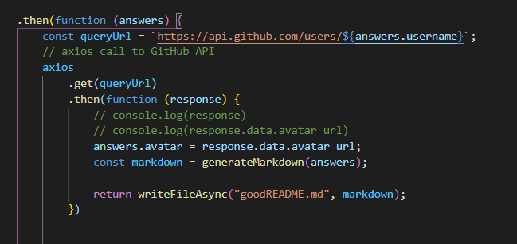
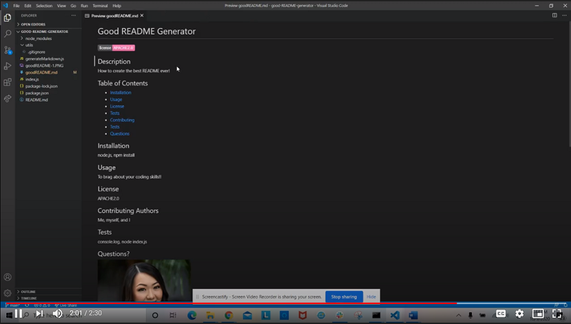

# Good README Generator

It is important to have a quality README.md with information about the application when creating an open source project on GitHub. The application should answer what it is used for, what resources are needed and how to install them, how to report issues, and how to make contributions so that other developers are more likely to use and contribute to the success of the application/project. 

 

This command-line application will allow for quick and easy generation of a project README to get started quickly. This will allow a project creator to spend more time working on finishing the project and less time creating a good README.

 

## Coding Process

The coding process wasn't so bad until I found myself struggling with how to load the user's GitHub user profile picture with username input. At first, I hard coded my personal GitHub profile picture; however, I knew there had to be a way to extract data information from GitHub. 

Finally, I found a way by creating an axios call to retreive data information from the GitHub API. Please see the code below.

 

To view the demo of this application, please navigate to the **Demo Link** below or  [click here](https://drive.google.com/file/d/1ZUi_FjFtooDOfInEGDim1jUedjpa8o1w/view) to view.

 

## Powered By

* [Javascript](https://developer.mozilla.org/en-US/docs/Web/JavaScript)
* [jQuery](https://jquery.com/)
* [Node.js](https://nodejs.org/en/)
* [npm install](https://nodejs.org/en/)
* [inquirer nodejs](https://www.npmjs.com/package/inquirer)
* [dotenv nodejs](https://www.npmjs.com/package/dotenv)
* [axios nodejs](https://www.npmjs.com/package/axios)
* [Markdown](https://www.markdownguide.org/)
* [GitHub API](https://api.github.com/users/)

 

### Other Resources Used

* [Visual Studio Code](https://code.visualstudio.com/)
    * [How to install VS Code](https://code.visualstudio.com/docs/setup/setup-overview)
* [GitBash](https://gitforwindows.org/)
    * [Download GitBash for Windows](https://git-scm.com/downloads)

 

## Demo Link

* [See Demo Link](https://drive.google.com/file/d/1ZUi_FjFtooDOfInEGDim1jUedjpa8o1w/view)

 

## Author
**Christy Lee** 

- [Github](https://github.com/christyglee)
- [LinkedIn](https://www.linkedin.com/in/christy-g-lee/)

  

## Acknowledgments

* [Google-Fu](https://www.google.com)
* [w3schools](https://www.w3schools.com/)
* [Stack Overflow](https://stackoverflow.com/search?q=over)
* [Node.js](https://nodejs.org/en/)
* [npm install](https://nodejs.org/en/)
* [Markdown](https://www.markdownguide.org/)
* [GitHub API](https://api.github.com/users/)